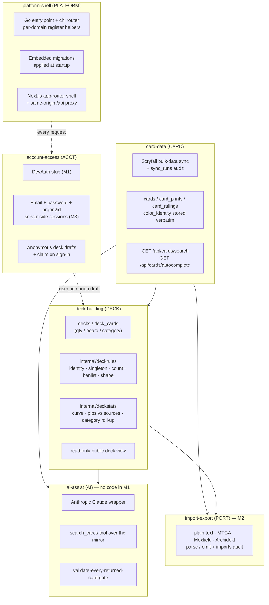

# High-Level Design: Manafold

## Problem

Building a Magic: The Gathering *Commander* deck has a high rules-and-knowledge
floor. A legal deck is exactly 100 cards, singleton except for basic lands and a
handful of cards that override the rule in their own text; every card must fall
inside the commander's colour identity (a subtle computation over cost, rules
text, hybrid and Phyrexian pips, and both faces of a double-faced card); a short
but non-obvious banlist applies; and a "good" deck roughly follows a
ramp/draw/removal/wipe/land template and sits at a recognisable power bracket.
The dominant community builders (Moxfield, Archidekt) are fast, well-made list
editors, but they are generic — they do not enforce Commander legality while you
build, and they do not help you reason about synergy or power level. A player
who wants the rules handled for them, and wants help thinking about the deck, has
no tool built around that.

## Approach

Manafold is a Commander-first deckbuilder on a local mirror of Scryfall's card
data, with three load-bearing disciplines.

### Own the card layer

All search, autocomplete, and card-detail traffic is served from Manafold's own
Postgres, populated by a daily job that ingests Scryfall's bulk-data exports.
Scryfall's card endpoints are never called on a client request path — only by
the sync job and by a rare explicit "this printing isn't mirrored yet" fallback
on card add. This is what makes Manafold's core operation — joining a deck's
cards against their colour identity, singleton limits, and legality — a database
query rather than a rate-limited third-party API call.

### Rules are structural

Colour identity, singleton (with per-card limits), the 100-card count, and the
banlist are validated by the system every time a deck changes, and the result is
surfaced as a live report rather than left to the user to police. Manafold does
not recompute colour identity — it stores Scryfall's `color_identity` field
verbatim and trusts it, because Scryfall already handles the hybrid, Phyrexian,
and double-faced-card edge cases correctly. Per-card singleton limits and
"can be a commander" are derived once, at sync time, from Oracle text.

### The model curates and explains; statistics and rules decide

The AI layer (no code in M1) treats the language model as an explainer and
curator on top of a deterministic engine. Recommendation *quality* comes from
decklist statistics (`edhrec_rank` now; a co-occurrence corpus and EDHREC
synergy data later); *legality* is enforced by re-validating every card the
model returns against the real card table and `internal/deckrules` before it is
shown, silently dropping anything that fails. The model never invents a card and
can never surface one outside the deck's colour identity.

## Target Users

Commander players building or tuning a 100-card deck who want the format's rules
enforced for them and want help reasoning about synergy, mana base, and power
level — the player who currently keeps a deck in Moxfield and a second tab open
to Scryfall and EDHREC to check legality and staples by hand. Secondarily,
Manafold is a real full-stack portfolio project (Go/chi/pgx, Next.js, LLM
tool-use, Linked-Intent Design from inception), so the code itself is an
artifact and favours being legible over being clever.

## Goals

- A working vertical slice (M1): create a deck, set a commander, search and add
  cards with live colour-identity + singleton + count + banlist validation, and
  view the decklist — exercising every layer end to end.
- Every card shown anywhere in the product is a real card from the mirror;
  nothing the AI surfaces is banned, nonexistent, or outside the deck's colour
  identity.
- Import/export parity with the community text formats (M2).
- A deterministic deck-health report against Commander heuristics (M5), with an
  AI prose summary layered on top that can fail without breaking the report.
- A read-only public deck share URL (part of v1).

## Non-Goals

- **v1**: no playtester / goldfish / sample hand, no collection tracking, no
  social feed / comments / following, no deck version diffing or named
  snapshots, no folders, no price-history charts or affiliate links, no
  non-Commander formats (Brawl, Oathbreaker), no native or mobile-tuned builder
  — responsive web only.
- Manafold never calls Scryfall's card endpoints on a client-facing request
  path.
- Manafold does not recompute colour identity; it stores and trusts Scryfall's.
- Manafold is not a monetized product and does not paywall Scryfall data.
- No bring-your-own-key for AI in v1 (a BYOK escape hatch is a possible later
  addition, not a v1 surface).
- The later features listed under **Roadmap** are designed for but not built
  now; the architecture must not preclude them.

## Tenets

Ordered so that when two conflict, the higher one wins.

- **Own the card data.** Serve every card request from our own mirror of
  Scryfall; never call the card API on a client request path. *(Defensible
  opposite: stay thin and call Scryfall live, accepting the coupling for
  less infrastructure.)*
- **Rules are structural, not advisory.** Colour identity, singleton, count, and
  legality are enforced by the system and validated against Scryfall's own
  fields, not left to the user to police or re-derived by us. *(Defensible
  opposite: show the data and let the player judge, like a generic list
  editor.)*
- **The model curates and explains; statistics and rules decide.** Every card
  the AI surfaces is a real, legal card re-validated against the card table
  before display; recommendation quality comes from decklist statistics, not the
  model's parametric memory. *(Defensible opposite: trust the model's card
  knowledge directly and prompt it to stay grounded.)*
- **Legible over clever.** Prefer real SQL via `sqlc` and explicit code over an
  ORM or framework magic — the code is a portfolio artifact and a maintainer
  should not have to reverse-engineer ingenuity. *(Defensible opposite: an ORM
  / higher-level framework for development speed.)*

## System Design

Six segments. `platform-shell` provides the routing/rendering substrate every
other segment runs on. `account-access` gates every `/api/*` request.
`card-data` owns the Scryfall mirror and is read by `deck-building`,
`import-export`, and `ai-assist`. `deck-building` owns decks and the legality
validator and is read by `ai-assist` and `import-export`.

Dependency DAG (`docs/arrows/index.yaml` is authoritative):

| Segment | blockedBy | blocks |
|---|---|---|
| `platform-shell` | — | `account-access`, `card-data`, `deck-building` |
| `account-access` | `platform-shell` | `deck-building` |
| `card-data` | `platform-shell` | `deck-building`, `import-export`, `ai-assist` |
| `deck-building` | `card-data`, `account-access` | `ai-assist`, `import-export` |
| `import-export` | `card-data`, `deck-building` | — |
| `ai-assist` | `card-data`, `deck-building` | — |

## Key Design Decisions

- **Mirror Scryfall bulk data into Postgres; sync daily; never crawl the card
  endpoints at request time.** *Alternatives:* a pure live Scryfall API
  integration (rejected — the 10 req/s limit plus per-keystroke autocomplete
  would break with a handful of concurrent users, and Scryfall's own terms
  *require* bulk data for high-volume use); a one-time static import with no sync
  (rejected — the banlist, prices, and new sets go stale within weeks). Manafold
  also needs to *join* card data against decks for its core validation, which is
  a database operation, not an API one. Live Scryfall calls are confined to the
  sync job and an explicit single-printing fallback on card add.

- **Store Scryfall's `color_identity` verbatim; do not compute it.** *Alternative:*
  derive colour identity from mana cost and rules text ourselves (rejected —
  Scryfall's field already correctly handles hybrid `{G/U}` and Phyrexian
  `{G/P}` pips, reminder-text exclusion, colour indicators, and the union across
  both faces of a double-faced card; reproducing that is pure downside risk).
  Per-card `singleton_limit` and `can_be_commander` *are* derived by Manafold,
  once, at sync time from Oracle text, because Scryfall has no direct field for
  either.

- **Validate legality against Scryfall's `legalities.commander` field, plus a
  small manual-override table.** *Alternative:* a hand-curated banlist (rejected
  — Scryfall's field already merges the functional bans, the old ante and
  *Conspiracy* cards, the offensive-content bans, and `restricted`/`not_legal`,
  and updates when the Commander Format Panel acts). The override table exists
  only to cover the gap between a Panel announcement and Scryfall's next data
  refresh.

- **AI provider: Anthropic Claude, developer-held key, server-side per-user
  quotas + a global spend cap — not bring-your-own-key.** *Alternatives:* OpenAI
  to match the sibling project's actual code (rejected — Manafold is a fresh
  project with no OpenAI code to stay consistent with, and Claude is the stated
  direction); BYOK (rejected for v1 — AI assistance is a core, always-on feature
  of the pitch, and requiring an API key before a user can get a card suggestion
  would gut adoption). A BYOK escape hatch may be added later. No AI code ships
  in M1; this decision only shapes the `ai-assist` LLD and the `internal/ai`
  stub.

- **Auth: Manafold's own email + password (argon2id), server-side sessions, a
  `DEV_AUTH` stub, and anonymous deck drafts claimable on sign-in.**
  *Alternatives:* Google OAuth (deferred — the first pass ships Manafold's own
  logins; the `account-access` design keeps OAuth providers addable later); no
  auth / local-only decks (rejected — a shared public deck URL and per-user
  ownership need real accounts). M1 runs on the `DEV_AUTH` stub only; the real
  login flow is implemented at M3.

- **Deck organization: Archidekt-style functional categories, not Moxfield-style
  light tags.** `deck_cards.category` is free-text, filled by a server-side
  auto-categorizer (a stub in M1) seeded from Oracle-text heuristics and
  Scryfall's `oracle_tags`. The functional groups (Removal, Counterspell, Ramp,
  Card Draw, Board Wipe, Land, …) are first-class in the category model and,
  later, the builder UI. *Alternative:* a lighter per-card tag system (rejected —
  category-first building is materially better for "I want ~10 ramp / ~10 draw /
  ~5 removal / ~3 wipes" Commander deckbuilding).

- **Monorepo, Go + chi + pgx/sqlc backend, Next.js/TypeScript/Tailwind
  frontend, mirroring the sibling project's proven topology.** Migrations are
  embedded via `//go:embed` and applied by the API binary at startup, before the
  connection pool opens, so the binary that expects a schema is the one that
  applies it. `sqlc` over an ORM keeps SQL visible and type-safety generated.
  The frontend reaches the backend only through a same-origin `/api/*` rewrite,
  so the session cookie is first-party.

- **Hosting: Vercel (frontend) + Render Docker (backend) + Neon Postgres, with
  the card-sync job as a Render cron.** `DATABASE_URL` must be Neon's direct
  (non-pooled) connection string, for both the startup migration and the app's
  pool. CI is GitHub Actions with a Postgres service container; the no-mistakes
  pipeline leans on it (`ci: { no_ci: true }`).

## Success Metrics

- The M1 slice works end to end against real Postgres: a deck can be created, a
  commander assigned (and rejected when the card cannot be a commander), cards
  added in and out of colour identity, and the validation report reflects
  colour-identity violations, singleton violations, the `main`+`command` count
  and its deviation from 100, and banned cards.
- **Falsification signal:** any card shown as an AI suggestion that is banned,
  nonexistent, or outside the deck's colour identity means the validation gate
  has failed.
- **Falsification signal:** a decklist import (M2) that silently drops a
  resolvable card name means the parser has regressed.
- **Falsification signal:** a `deck_cards` mutation succeeding against a deck the
  caller does not own means ownership-in-query has regressed — the API must
  return `404`.
- **Falsification signal:** Manafold issuing an HTTP request to a
  `api.scryfall.com/cards/*` endpoint from anything other than the sync job or
  the explicit single-printing card-add fallback means the "own the card data"
  tenet has been violated in code.

## Roadmap

Milestones after M1 (the segment map does not change; these add specs and code):

| M | Deliverable | Segments |
|---|---|---|
| **M2** | Import/export (plain-text, MTGA, Moxfield, Archidekt) with unresolved-name reporting; deterministic deck stats (curve, colour pips vs sources, type & category counts, average mana value) | `import-export`, `deck-building` |
| **M3** | Real email + password auth (argon2id) + server-side sessions; deck ownership on real users; anonymous drafts + claim-on-sign-in; the read-only public deck URL | `account-access`, `deck-building` |
| **M4** | AI v1: "suggest & explain" (candidate pool + Claude call + `search_cards` tool + validate-every-card gate) and single-card fit blurbs | `ai-assist` |
| **M5** | Deterministic deck-health report vs Commander heuristics, with an LLM prose summary + prioritized fixes | `deck-building`, `ai-assist` |
| **M6** | Bracket / power-level estimate: Game-Changers count + Commander Spellbook two-card-combo match + extra-turn / mass-land-denial detection | `ai-assist`, `card-data` |
| **M7** | Budget-swap suggestions; deck version history | `ai-assist`, `deck-building` |
| **M8** | Collection tracking + "play with owned"; "build a shell from a commander" | `collections`, `ai-assist` |
| **M9** | Playtester / goldfish / sample hand; combo detection surfaced inline | new segment; `ai-assist` |

Later features the architecture must not preclude (design notes only, recorded
in the owning LLDs' *Open Questions & Future Decisions*):

1. **Deck-bootstrapping wizard** — commander → auto mana base from the colour
   identity → a wizard adding the most powerful/common cards for those colours
   (`deck-building` + `ai-assist`; a lighter-weight relative of M8's "build a
   shell").
2. **EDHREC high-synergy cards** as a recommendation input beyond `edhrec_rank`
   (`ai-assist`; EDHREC has no official public API — the data-access approach and
   its Terms of Service are an open question).
3. **Constrained deck generation beyond brackets** — budget cap, "no infinite
   combos", "no tutors", tribe/theme lock, house rules (`ai-assist`
   constraint-driven generation).
4. **Functional-subtype grouping first-class** in the category model and builder
   UI (`deck-building`; reinforces the functional-category decision above).
5. **Cut suggestions / replacement discussion** — surface underperforming or
   low-synergy cards as cut candidates with suggested replacements, low-friction
   swap UX (`ai-assist` deck-health + `deck-building` swap UX).

## FAQ

**Why store the whole Scryfall corpus instead of querying Scryfall?** Manafold's
core operation is joining a deck's cards against their colour identity, singleton
limit, and legality — a SQL join. It also does per-keystroke autocomplete, which
would blow Scryfall's 10 req/s limit with a few concurrent users, and Scryfall's
own terms require bulk data for high-volume use. The corpus is ~25 MB (Oracle) +
~78 MB (Default) compressed and changes slowly.

**Does the AI ever get to name a card from its own knowledge?** No. Every card
the AI surfaces is looked up in the mirror and re-validated against
`internal/deckrules` for the current deck's colour identity before it is shown;
anything that fails is dropped silently. The model chooses *which* real, legal
cards to surface and explains them; it does not supply the card list.

**Is there an automated test suite?** Yes — Go stdlib `testing`: table-driven
unit tests for `internal/deckrules`, integration tests for the deck endpoints
against a real Postgres (locally, and in CI via a service container), a
fixture-JSONL ingestion test for `internal/cardsync`, and a `migrate_test.go`
that runs the embedded migrations against an empty schema. The frontend uses
Node's built-in test runner.

## References

- `MANAFOLD.md` — the project's product-level decision log and status narrative.
- `docs/intent/` — the six leaf LLDs and their EARS specs; `docs/arrows/` — the
  arrow overlay.
- `README.md` — local development quickstart.
- Scryfall API and bulk data: <https://scryfall.com/docs/api>,
  <https://scryfall.com/docs/api/bulk-data>, <https://scryfall.com/docs/terms>.
- Official Commander rules: <https://mtgcommander.net/index.php/rules/>.
- GitHub: `github.com/Sushi-Senpai/Manafold` (public).
